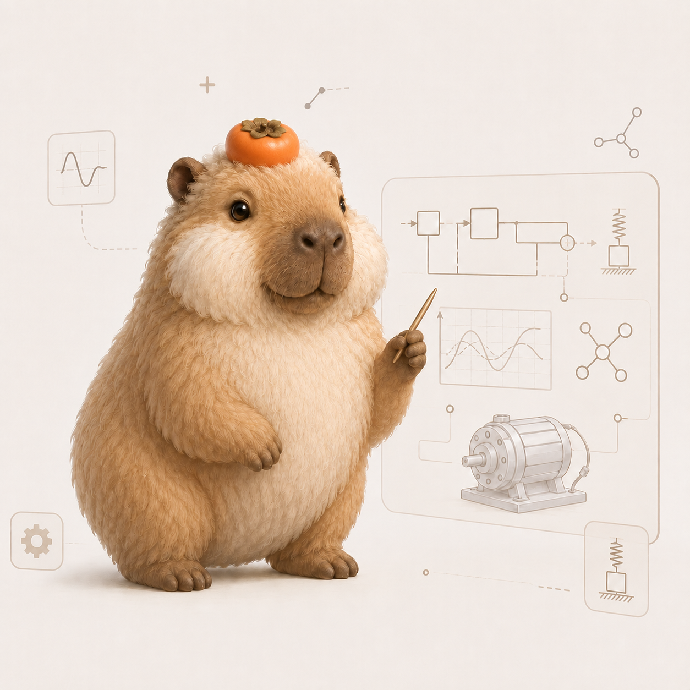

# Pufibara — AI Agent for Physical Systems Modeling

  &nbsp;
  &nbsp;
  &nbsp;
  <a href="https://www.python.org/" style="text-decoration:none;">= 3.10" /></a>

  

<strong>Current research release: v0.213.979</strong>

## Agentic Modelica Workflow Benchmark

*Benchmark snapshot as of August 17, 2026.*

Each comparison uses the same backend model for Pufibara and Claude Code.

The benchmark covers three Modelica workflow families:

| Workflow | Task | Validation |
| :--- | :--- | :--- |
| Repair | Fix a broken model | Check + simulation |
| Generation | Build a model from a task brief | Check + simulation + behavioral validation |
| Tuning | Calibrate model parameters | Check + simulation + held-out validation |

### Backend: DeepSeek v4 Flash

#### Model Repair

| Agent | Total | Easy | Medium | Hard | Pass rate | Tokens | Runtime |
| :---: | :---: | :---: | :---: | :---: | :---: | :---: | :---: |
| **Pufibara** | **130/132** | 21/21 | 56/56 | 53/55 | **98.48%** | **39.8M** | **4.07h** |
| Claude Code | 124/132 | 21/21 | 56/56 | 47/55 | 93.94% | 227M | 9.78h |

Pufibara vs Claude Code: **Pass rate ↑ 4.8% · Tokens ↓ 82.5% · Runtime ↓ 58.4%**

#### Model Generation

| Agent | Total | Easy | Medium | Hard | Pass rate | Tokens | Runtime |
| :---: | :---: | :---: | :---: | :---: | :---: | :---: | :---: |
| **Pufibara** | **35/50** | 2/2 | 10/10 | 23/38 | **70.00%** | **17.0M** | **2.34h** |
| Claude Code | 27/50 | 2/2 | 10/10 | 15/38 | 54.00% | 81.1M | 2.49h |

Pufibara vs Claude Code: **Pass rate ↑ 29.6% · Tokens ↓ 79.0% · Runtime ↓ 6.1%**

#### Model Tuning

| Agent | Total | Easy | Medium | Hard | Pass rate | Tokens | Runtime |
| :---: | :---: | :---: | :---: | :---: | :---: | :---: | :---: |
| **Pufibara** | **37/50** | 4/4 | 24/24 | 9/22 | **74.00%** | **22.9M** | **3.56h** |
| Claude Code | 34/50 | 4/4 | 23/24 | 7/22 | 68.00% | 111.6M | 6.96h |

Pufibara vs Claude Code: **Pass rate ↑ 8.8% · Tokens ↓ 79.5% · Runtime ↓ 48.8%**

### Backend: Sonnet 5

#### Model Repair

| Agent | Total | Easy | Medium | Hard | Pass rate | Tokens | Runtime |
| :---: | :---: | :---: | :---: | :---: | :---: | :---: | :---: |
| **Pufibara** | **131/132** | 21/21 | 56/56 | 54/55 | **99.24%** | **36.2M** | **3.68h** |
| Claude Code | 125/132 | 21/21 | 56/56 | 48/55 | 94.70% | 177.7M | 8.76h |

Pufibara vs Claude Code: **Pass rate ↑ 4.8% · Tokens ↓ 79.6% · Runtime ↓ 58.1%**

#### Model Generation

| Agent | Total | Easy | Medium | Hard | Pass rate | Tokens | Runtime |
| :---: | :---: | :---: | :---: | :---: | :---: | :---: | :---: |
| **Pufibara** | **32/50** | 2/2 | 10/10 | 20/38 | **64.00%** | **13.6M** | **2.73h** |
| Claude Code | 26/50 | 2/2 | 10/10 | 14/38 | 52.00% | 77.1M | 2.91h |

Pufibara vs Claude Code: **Pass rate ↑ 23.1% · Tokens ↓ 82.4% · Runtime ↓ 6.3%**

#### Model Tuning

| Agent | Total | Easy | Medium | Hard | Pass rate | Tokens | Runtime |
| :---: | :---: | :---: | :---: | :---: | :---: | :---: | :---: |
| **Pufibara** | **39/50** | 4/4 | 24/24 | 11/22 | **78.00%** | **20.5M** | **5.12h** |
| Claude Code | 36/50 | 4/4 | 24/24 | 8/22 | 72.00% | 86.7M | 10.43h |

Pufibara vs Claude Code: **Pass rate ↑ 8.3% · Tokens ↓ 76.4% · Runtime ↓ 51.0%**

*Metrics use relative pass-rate improvement, matched logical-token accounting, and sequential runtime excluding infrastructure-only attempts.*

Across these benchmark runs, Pufibara's prompt-cache management achieved a **90%–93% cache hit rate**, enabling efficient context reuse across long-running Modelica workflows.

  

## Legal Notice

Without prior written permission, no content on this site may be used for AI model training, fine-tuning, evaluation, or dataset construction.

- [Legal Notice](LEGAL_NOTICE.md)
- [Content Authorization Policy](CONTENT_AUTHORIZATION_POLICY.md)
- [robots.txt](robots.txt)
